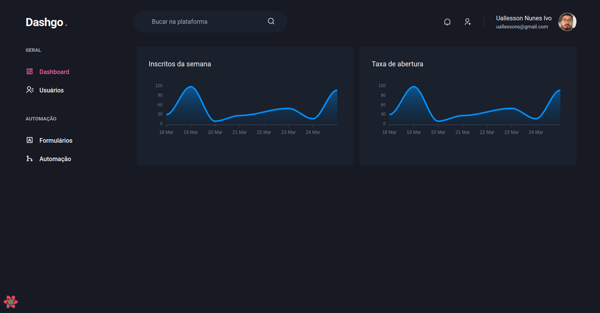
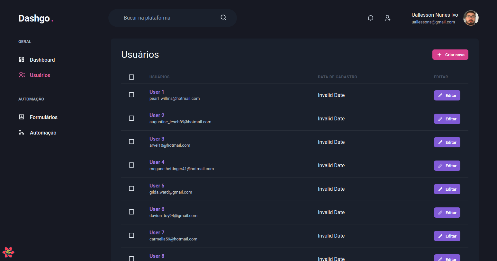
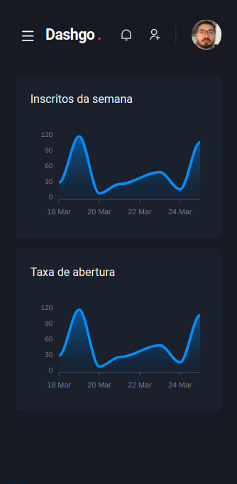
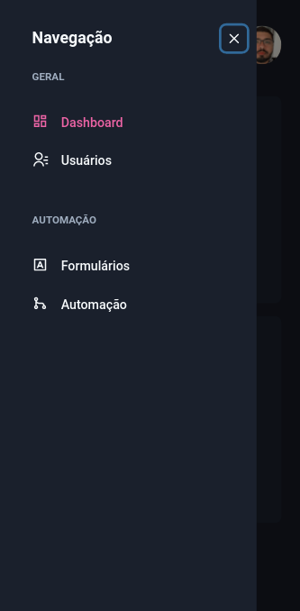

<h1 align="center">
  Dashgo
  <br>
</h1>

<h4 align="center">Site com sistema de upload de imagens</h4>

<p align="center">
  <a href="#stack">Stack</a> •
  <a href="#features">Features</a> •
  <a href="#how-to-use">How to use</a> •
</p>

<p align="center">
  
  
</p>


## STACK

- Typescript
- Next.js
- Chakra UI
- Yup
- React Hook Form

<p align="center" >
  
  
</p>

## Features

- Design responsivo
- Cadastro e listagem de usuários
- Paginação dinâmica
- Drawer

## How to use

```bash
# Clone this repository
$ git clone https://github.com/Uallessonivo/dashgo

# Go into the repository
$ cd dashgo

# Install dependencies
$ yarn

# Run the app
$ yarn dev
```

Note: If you're using Linux Bash for Windows, [see this guide](https://www.howtogeek.com/261575/how-to-run-graphical-linux-desktop-applications-from-windows-10s-bash-shell/) or use `node` from the command prompt.

## License

MIT

---
